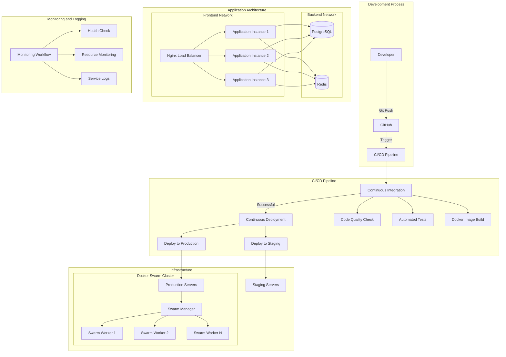
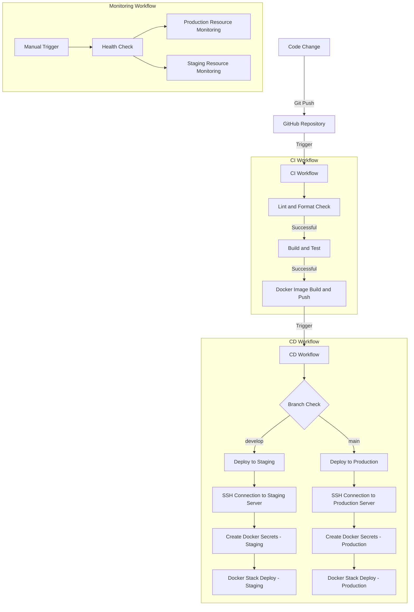
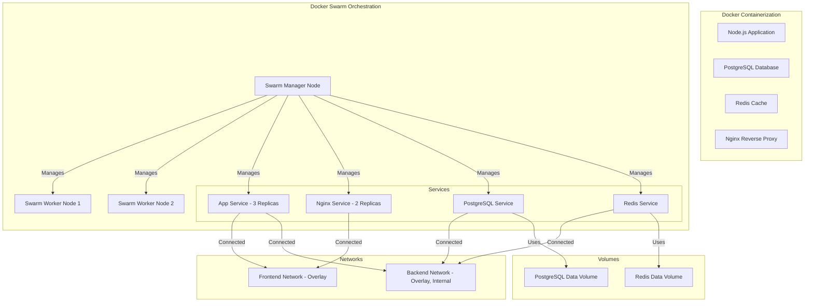
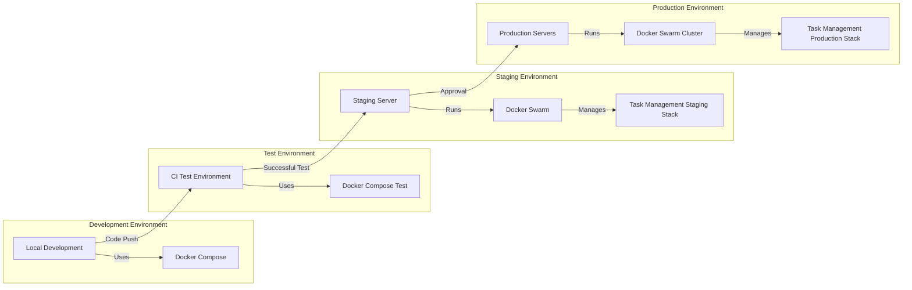
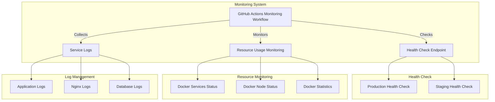
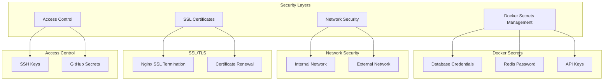

# Task Management API

A robust task management API built with Node.js, Express, PostgreSQL, and Redis, deployed using Docker Swarm.

## Table of Contents
- [Local Development Environment Setup](#local-development-environment-setup)
- [Docker Compose Setup](#docker-compose-setup)
- [GitHub Workflows](#github-workflows)
- [Docker Swarm Deployment](#docker-swarm-deployment)
- [Architecture Overview](#architecture-overview)
- [Troubleshooting](#troubleshooting)

## Local Development Environment Setup

### Prerequisites
- Node.js 20.x
- npm 10.x
- Docker and Docker Compose
- Git

### Installation Steps
1. Clone the repository:
```bash
git clone https://github.com/yuciferr/devops-engineer-project.git
cd devops-engineer-project
```

2. Install dependencies:
```bash
npm install
```

3. Set up environment variables:
```bash
cp .env.example .env
```

4. Start the development server:
```bash
npm run dev
```

## Docker Compose Setup

### Development Environment
1. Build and start the services:
```bash
docker compose up --build
```

### Testing Environment
1. Run the test suite:
```bash
docker compose -f docker-compose.test.yml up --build --exit-code-from test
```

### Production Environment
1. Build and start the production services:
```bash
docker compose -f docker-compose.prod.yml up --build
```

## GitHub Workflows

The project includes three main GitHub workflows:

### 1. CI Pipeline (.github/workflows/ci.yml)
- Triggered on push and pull requests to develop and main branches
- Steps:
  - Lint and format check
  - Build and test
  - Build and push Docker image (on successful merge)

### 2. CD Pipeline (.github/workflows/cd.yml)
- Triggered after successful CI pipeline
- Deploys to:
  - Staging environment (develop branch)
  - Production environment (main branch)

### 3. Monitoring (.github/workflows/monitoring.yml)
- Runs every 15 minutes
- Performs health checks
- Monitors resource usage

## Docker Swarm Deployment

### Infrastructure Setup
- Manager Node: AWS EC2
- Worker Node 1: AWS EC2
- Worker Node 2: AWS EC2

### Initial Swarm Setup
1. Initialize Swarm on manager node:
```bash
docker swarm init --advertise-addr 16.170.192.227
```

2. Join worker nodes using the token provided by the manager:
```bash
docker swarm join --token <WORKER-TOKEN> 16.170.192.227:2377
```

### Deployment Steps
1. On the manager node, create required secrets:
```bash
echo "your-postgres-password" | docker secret create postgres_password -
echo "your-redis-password" | docker secret create redis_password -
```

2. Deploy the stack:
```bash
docker stack deploy -c docker-compose.prod.yml task-management
```

3. Verify deployment:
```bash
docker stack ps task-management
```

### Scaling Services
```bash
docker service scale task-management_app=3
```

## Architecture Overview

### General Architecture



### CI/CD Pipeline



### Containerization and Orchestration



### Environments



### Monitoring and Logging



### Security



## Troubleshooting

### Common Issues and Solutions

1. **Database Connection Issues**
   - Verify PostgreSQL credentials in .env file
   - Check if PostgreSQL container is running: `docker ps`
   - Ensure proper network connectivity: `docker network ls`

2. **Redis Connection Issues**
   - Verify Redis password in .env file
   - Check Redis container logs: `docker logs <redis-container-id>`

3. **Docker Swarm Issues**
   - Check node status: `docker node ls`
   - Verify service logs: `docker service logs task-management_app`
   - Ensure proper network overlay: `docker network inspect task-management_backend`

4. **CI/CD Pipeline Failures**
   - Check GitHub Actions logs for detailed error messages
   - Verify environment secrets are properly set in GitHub repository
   - Ensure proper permissions for GitHub Actions

### Health Checks
- Application: `http://<host>/health`
- PostgreSQL: Check container health status
- Redis: Monitor memory usage and connections

For additional support or issues, please create a GitHub issue or contact the maintainers.